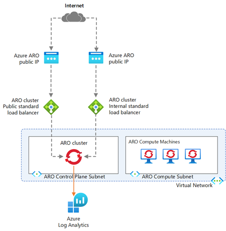

# Deploy Azure Red Hat OpenShift

## Architecture

## Objectives
In this section, you will:
- Deploy Azure Red Hat OpenShift using the Azure CLI
- Access the OpenShift Web Console
- Access OpenShift via CLI