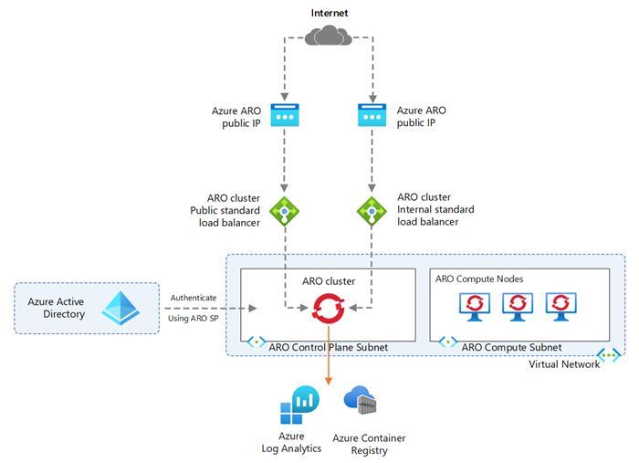

# Configure Azure Integrations

## Architecture

## Objectives
In this section you will deploy and integrate various Azure services into Azure Red Hat OpenShift 4.

## Instructions

In this section, you will:
- Configure Azure Active Directory authentication
- Configure Azure Container Registry
- Configure Azure ARC for Observibility